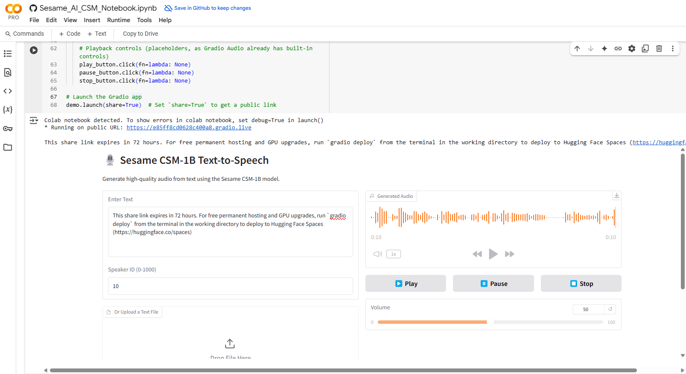

# 🧠 Sesame CSM-1B Google Colab Notebook

[](https://colab.research.google.com/github/Justmalhar/csm-google-collab/blob/main/Sesame_AI_CSM_Notebook.ipynb)

> **Text-to-Speech Demo using Sesame's CSM-1B Model, Gradio UI, and HuggingFace Hub**





---

## 📌 Overview
This repository features a simple setup to convert text into speech using **Sesame's CSM-1B**, powered by Gradio and hosted on Hugging Face, featuring both an interactive notebook and a live demo space.

## 🚀 Quick Access

- ✅ Live Demo: [Hugging Face Space](https://huggingface.co/spaces/pallavi1428/seacsm)

- ⚡ Colab Notebook: [Sesame_AI_CSM_Notebook.ipynb](https://colab.research.google.com/github/Justmalhar/csm-google-collab/blob/main/Sesame_AI_CSM_Notebook.ipynb)

---

## 🧩 Features

- 🤖 Model: [`sesame/csm-1b`](https://huggingface.co/sesame/csm-1b) 
- 🔊 Input: Any custom text or textfile 
- 🎙️ Output: Audio with playback controls via `generator.generate()`
- 🌐 Deployment: Gradio UI with Hugging Face Spaces
- 💻 Notebook: Colab-ready with full setup included

---

## 🛠️ Installation (Notebook Setup)

1. Clone this repo and install requirements:

   ```bash
   pip install -r requirements.txt
   ```

2. Authenticate with Hugging Face:

   ```python
   from huggingface_hub import notebook_login
   notebook_login()
   ```

3. Load the model from the Sesame CSM repo.

4. Launch Gradio interface (simple or advanced mode).

---

## 🌍 Deployment on Hugging Face
A lightweight deployment is available here:  
🔗 https://huggingface.co/spaces/pallavi1428/seacsm

### Deployment Details
- `app.py`: Gradio application script
- `requirements.txt`: Dependencies for deployment

### Deployment Features
- Identical functionality to the Colab notebook
- No installation needed – runs directly in the browser
- Mobile-friendly UI, CPU-compatible for wider accessibility

---

## 🧬 Model Info

- Model: [sesame/csm-1b](https://huggingface.co/sesame/csm-1b)  
- Audio generation via `generator.generate()`  
- Original repository: [SesameAILabs/csm](https://github.com/SesameAILabs/csm)

---

## 🧬 License  
- **Notebook**: MIT  
- **Model**: [Sesame’s terms](https://huggingface.co/sesame/csm-1b)  

---

## 🧑‍💻 Author
- 👤 Malhar Ujawane
- 🐦 [Twitter](https://x.com/justmalhar)
- 💻 [GitHub](https://github.com/justmalhar)  

---